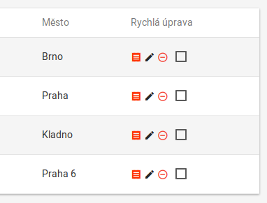

# Úpravy pluginu WP Contacts

_For English version see [README.md](README.md)._

[WordPress][1] plugin, který upravuje a doplňuje funkčnost pluginu [WP Contacts][2] tak, jak to požadoval můj klient pro svůj byznys.

Byl vyvýjen oproti pluginu [WP Contacts][2] verze __3.1.5__ a systému [WordPress][1] od verze __4.9.4__ do __4.9.5__.

## Vlastnosti

- přidává datový typ _kampaně_
- originální _front-end_ stránka s kontakty byla upravena
- přidány vlastní _front-end_ stránky: stránka pro správu kampaní a nová hlavní stránka pro uživatele s uživ. rolí `agent`
- plugin je lokalizovatelný a podporuje _multisites_

### Kampaně

- jsou připojeny k jednotlivým _kontaktům_, vytvořeny jsou admini a použity jsou jednotlivými obchodními agenty
- každá kampaň obsahuje tyto pole (a ještě pár dalších):
  - `tender_id`: `ID` uživatelského účtu přiděleného obchodního agenta,
  - `status`: jedna z těchto hodnot (_neotevřený_, _otevřený_, _uzavřený_),
  - `substatus`: závisí na hodnotě pole `status`, obsahuje řetězec - jednu z více možností,
  - `start_date`: datum, kdy má kampaň začít; od tohoto data, bude kampaň nabízena obchodním agentům,
  - `stop_date`: datum, kdy má kampaň skončit; může být ponecháno nenastavené a pak je automaticky kampaň ukončena při nastavení pole `status` na hodnotu _uzavřený_,
  - `author_id`: `ID` uživatelského účtu administrátora, který vytvořil kampaň,
  - `created`: obsahuje datum a čas chvíle, kdy byla kampaň vytvořena,
  - `editor_id`: `ID` uživatelského účtu uživatele, který naposledy kampaň upravil,
  - `modified`: datum a čas chvíle, kdy byla kampaň naposledy upravena.

### Front-end - úpravy původní stránky

#### Zobrazené řádky

Počet zobrazených řádků na jedné stránce může být nyní měněno přímo na této stránce a nemusíte přecházet do nastavení úvodní stránky:

### Odkaz na kampaně

Na každém řádku je ve sloupci <em>Rychlá úprava</em> nová ikonka, která obsahuje odkaz na stránku, kde administrátor může upravit kampaně pro zvolený kontakt:

### Front-end - kampaně

`XXX` __Dokončit tuto sekci!__

## Instalace

`XXX` __Dokončit tuto sekci!__

[1]: https://wordpress.net
[2]: http://wpcontacts.co/