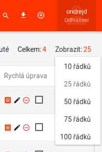
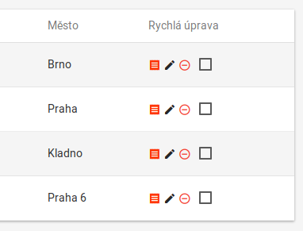

# Customizations for WP Contacts plugin

_Pro český překlad se podívejte do souboru [README.cs.md](README.cs.md)._

[WordPress][1] plugin that alters and extends functionality of [WP Contacts][2] plugin in way as one of my clients needed for its business.

It was developed against [WP Contacts][2] version __3.1.5__ and [WordPress][1] from version __4.9.4__ to __4.9.5__.

## Features

- added _campaigns_ data type
- original front-end page with leads listing was slightly modified
- own front-end with new campaigns listing page and new main front-end page for `agent` user role
- plugin is localizable (currently is plugin just in __Czech__)
- plugin supports multisites

### Campaigns

- are attached to single _leads_, created are by admins, and used are by agents
- contains these fields (among others):
  - `tender_id`: `ID` of user account of a single agent,
  - `status`: one of several choices (_not opened_, _opened_, _closed_),
  - `substatus`: depends on `status`, one of several choices,
  - `start_date`: date when should campaign start; from this date will be offered to logged agents,
  - `stop_date`: date when should campaign stop; can be omitted and then is set when `status` is changed to _closed_,
  - `author_id`: `ID` of user account of administrator who created the campaign,
  - `created`: date and time was campaign created,
  - `editor_id`: `ID` of user account of user who edited the campaign for the last time,
  - `modified`: date and time of the moment when was campaign edited for the last time.

### Front-end - old main page customizations

#### Displayed rows

Count of displayed rows on one page can be changed directly on the page not in the settings:

### Link to campaigns

On each row in edit column is new icon that contains link to page with campaings listing for selected _lead_:

### Front-end - campaigns

`XXX` __Finish this section!__

## Installation

`XXX` __Finish this section!__

[1]: https://wordpress.net
[2]: http://wpcontacts.co/